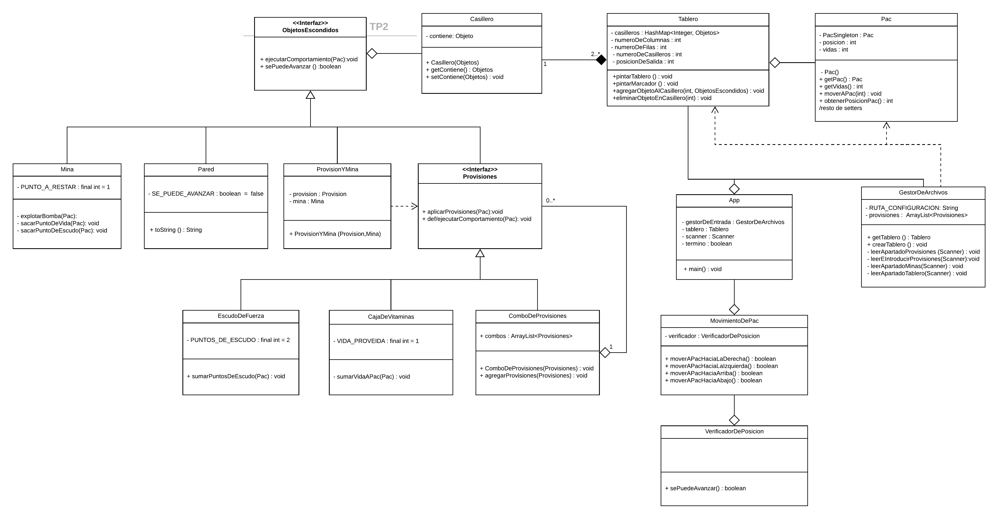

# Algoritmos y Programación II : TP 2

Integrantes: 
- Di Dio Gonzalo
- Lottero Bruno
- Lovera Alexander
- Posta Daniel

## Decisiones de diseño

- Se decidió representar el tablero mediante un diccionario cuya llave representa la posición del tablero en forma vectorial (de igual manera que se lee en el archivo de configuración), el valor es el objeto que contiene el casillero en dicha posición (mina, provision, etc). Para validar los movimientos que puede hacer el personaje según los limites del tablero, se utilizó aritmetica modular.

- Para poder representar provisiones compuestas se utilzó el patrón Composite.

- Para permitir que solo haya una instancia del tablero y del personaje, se utilizó el patrón singleton.

## UML

[Link a la imágen](UML_TP2.png)
